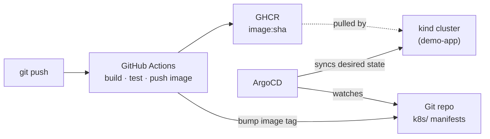

# gitops-demo

[](https://github.com/kalmi91/gitops-demo/actions/workflows/ci.yml)

Demonstrates a **GitOps delivery pipeline** — push code, CI builds + tests + pushes a container
image, and **ArgoCD** continuously syncs the desired state from Git into a
Kubernetes cluster.

> **$0 by design.** Kubernetes runs in [kind](https://kind.sigs.k8s.io); ArgoCD
> runs in the cluster; CI runs on **GitHub Actions** (free tier) and pushes to
> **GHCR** (free for public images). No cloud bill, no card.

## What this demonstrates

| Piece | Tool | Skill |
| ----- | ---- | ----- |
| CI: build → test → push image | GitHub Actions + GHCR | pipeline authoring (closes the Jenkins-only gap) |
| Container | multi-stage Dockerfile | image hygiene, small images |
| Desired state in Git | Kubernetes manifests (kustomize) | declarative k8s |
| Continuous delivery | **ArgoCD** | GitOps, auto-sync, drift detection |
| Cluster | kind | $0 Kubernetes |

## GitOps flow



The point of GitOps: **Git is the single source of truth.** Nobody runs
`kubectl apply` by hand — ArgoCD reconciles the cluster to match the repo.

## Running it

The Docker daemon, kind, and ArgoCD run on the host shell. See
`scripts/bootstrap.sh` to install the tooling.

## Usage

```bash
./scripts/bootstrap.sh   # once: install tools + start Docker
make up                  # kind cluster + install ArgoCD + apply the Application
make sync                # force an ArgoCD sync (otherwise auto)
make ui                  # open the ArgoCD UI (https://localhost:8080)
make down                # tear everything down — back to $0
```

## Repo layout

```
gitops-demo/
├── app/                # sample service (Go or Python) + Dockerfile
├── k8s/                # Kubernetes manifests ArgoCD syncs (kustomize)
├── argocd/             # ArgoCD install notes + the Application manifest
├── .github/workflows/  # build + test + push image, bump manifest tag
├── scripts/            # bootstrap.sh (run on host)
├── docs/               # DECISIONS.md, PORTFOLIO.md
└── Makefile
```

## More docs

- [`docs/DECISIONS.md`](docs/DECISIONS.md) — why each choice (ADR-lite).
